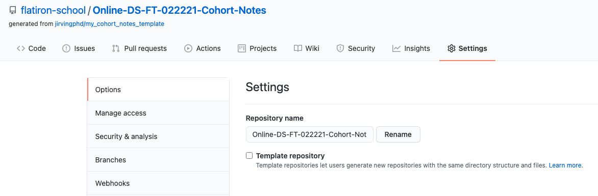

# Online-DS-FT-022221-Cohort-Notes
- All content from study groups for the online data science 022221 cohort will be added to this repository 


# Repo Organization
- Each phase will have its own folder. (e.g. "`Phase_1`")
- Each phase folder will contain subfolders for each topic
    - e.g."`topic_01_getting_started`"
    - So the full folder path would be "`Phase_1`>`topic_00_getting_started`
- The `reference docs` folder contains cheat sheets and we will be adding additional resources here. 


# How to Use This Repo
## Recommended Cloning Steps
- I recommend **cloning this repository directly** first, instead of forking it first. 
    - The Benefit:
        - This makes it much easier to get the newest notes just by running `git pull`
    - The Drawback:"
        - You will not be able to make/save any changes to the repo's contents or else it will cause sync conflicts. 

- The Compromise/Solution:
    - Make  a "cohort_notes" folder on you computer and `cd` into that folder with your terminal.
    - FIRST clone this repo directly. 
        - From your terminal that is currently located in yiour new cohort_notes folder. 
            - Run `git clone https://github.com/flatiron-school/Online-DS-FT-022221-Cohort-Notes.git`

    - SECOND, navigate to https://github.com/flatiron-school/Online-DS-FT-022221-Cohort-Notes,
        - Make a fork from this repository
        - Click on the "Settings" tab and then rename the repo to something other than "Online-DS-FT-022221-Cohort-Notes" 
        
            - Thi
        - Copy the URL of your newly renamed fork and run `git clone <your-repo-url-here>` where you replace "<your-repo-url-here>" with the url you just copied. 

    - Now you BOTH an easy-to-update cohort copy and your own editable/saveable version. 


## If you **insist** on only cloning yourn forked repo and want the updated notes...

- While it is recommended to clone this repo directly to get updates easily, below are excerpts from the official GitHub documentation on the steps required to sync a fork so that it receives changes made to the upstream repo (the one you forked). 
- **Even better, another Flatiron Instructor has made a [video walk-through of how to set up your own fork so that its easy to get the updates from the main repository.](https://youtu.be/UHASy7vpOIQ)**
    
### How to sync a fork of this repo


#### 1. [Configure a remote for the forked repo](https://help.github.com/en/github/collaborating-with-issues-and-pull-requests/configuring-a-remote-for-a-fork)
1. Open Terminal.
    - cd into repo
2. List the current configured remote repository for your fork.
`$ git remote -v`
3. Specify a new remote upstream repository that will be synced with the fork.
`$ git remote add upstream https://github.com/jirvingphd/online-dtsc-pt-041320-cohort-notes.git`

4. Verify the new upstream repository you've specified for your fork.
`$ git remote -v`

#### 2. [Syncing a fork]( https://help.github.com/en/github/collaborating-with-issues-and-pull-requests/syncing-a-fork)

1. Open Terminal.

2. cd into repo's folder
    
3. Fetch the branches and their respective commits from the upstream repository. Commits to master will be stored in a local branch, `upstream/master`.

`$ git fetch upstream`


4. Check out your fork's local master branch.

`$ git checkout master`

5. Merge the changes from upstream/master into your local master branch. This brings your fork's master branch into sync with the upstream repository, without losing your local changes.
`$ git merge upstream/master`

If your local branch didn't have any unique commits, Git will instead perform a "fast-forward":


> Tip: Syncing your fork only updates your local copy of the repository. To update your fork on GitHub, you must push your changes.

## Importing the `functions_SG.py` in topic study group notebooks
- Add the following block of code to your notebook
- Change the `py_folder` path to reflect where the repo's py_files folder is relative to the notebook you are adding this to.
```python
## Importing our study group functions
%load_ext autoreload
%autoreload 2
import sys
    
py_folder = "../../py_files/" # CHANGE TO REFECT YOUR NOTEBOOKS LOCATION COMPARED TO THE PY_FILES FOLDER
sys.path.append(py_folder)
import functions_SG as sg
```

 
